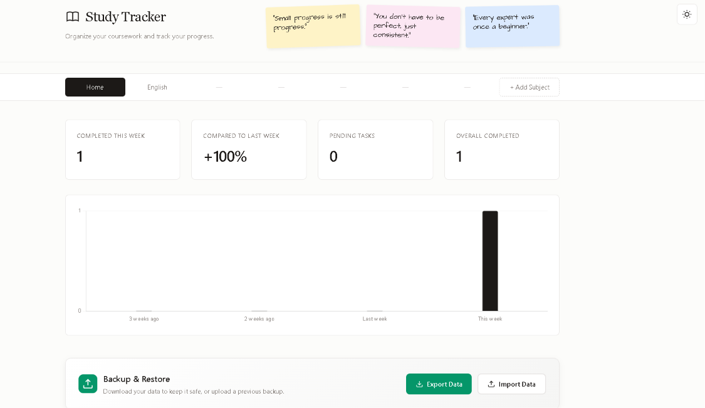

# 📚 Study Tracker

A minimalist, aesthetic study tracker to organize tasks by subject and teacher. Track weekly progress with interactive charts and stay motivated with sticky notes. 

Built with vanilla JS & LocalStorage — 100% offline, no backend, and completely private.

## ✨ Features

- **Hierarchical Organization:** Structure your work by Subject → Teacher → Tasks.
- **Smart Analytics:** Track tasks completed this week and compare them to last week.
- **Visual Progress:** Interactive 4-week bar chart powered by Chart.js.
- **Motivational UI:** Clean, editorial design with handwritten sticky notes.
- **Privacy First:** All data is stored locally in your browser. No accounts, no tracking.

## 🛠️ Tech Stack

- **Frontend:** 

- **Charting:** [Chart.js](https://www.chartjs.org/)
- **Storage:** Browser LocalStorage API
- **Fonts:** Architects Daughter (Google Fonts)

## 🚀 How to Use

No installation or backend required!

1. Clone or download this repository.
2. Open the `index.html` file in any modern web browser.
3. Start adding your subjects, teachers, and tasks!

*(Your data will be automatically saved in your browser's local storage.)*

## 📸 Preview

## 👤 Author

Made by **Angel Guragain**

## 📄 License

This project is open source and available under the [MIT License](LICENSE).

